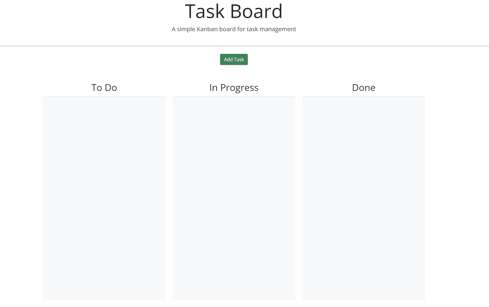

# task_board

## Description 

This is a task board. A tool used to represent work and its path towards completion. This includes tasks that are in progress, finished tasks and upcoming tasks.

- To help individuals structure their tasks.
- Drag & Drop your tasks into folders.
- Achieve your goals in an organized way.

## Example

## Links

For access to deployed website [Click Here](https://parryprogramming.github.io/task_board/)

